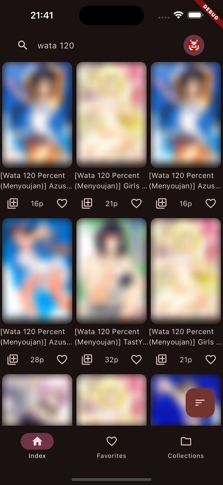
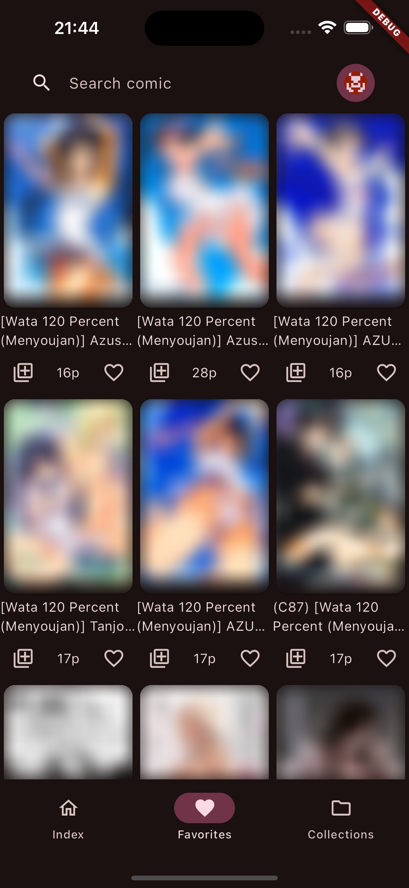
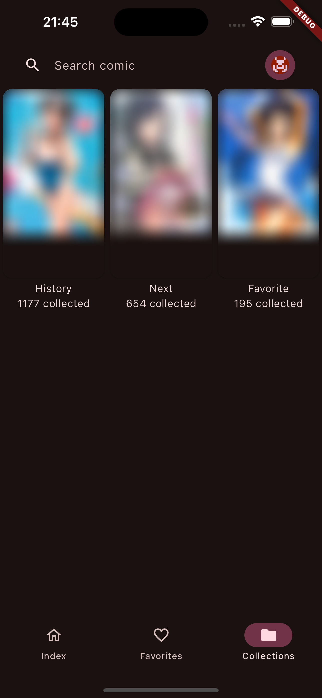

<!-- Improved compatibility of back to top link: See: https://github.com/othneildrew/Best-README-Template/pull/73 -->
<a name="readme-top"></a>
<!--
*** Thanks for checking out the Best-README-Template. If you have a suggestion
*** that would make this better, please fork the repo and create a pull request
*** or simply open an issue with the tag "enhancement".
*** Don't forget to give the project a star!
*** Thanks again! Now go create something AMAZING! :D
-->


<!-- PROJECT SHIELDS -->
<!--
*** I'm using markdown "reference style" links for readability.
*** Reference links are enclosed in brackets [ ] instead of parentheses ( ).
*** See the bottom of this document for the declaration of the reference variables
*** for contributors-url, forks-url, etc. This is an optional, concise syntax you may use.
*** https://www.markdownguide.org/basic-syntax/#reference-style-links
-->
[](https://github.com/ttdyce/nhviewer-universal/actions/workflows/flutter-workflow.yml)
<br />
[![Contributors][contributors-shield]][contributors-url]
[![MIT License][license-shield]][license-url]
<!-- [![Forks][forks-shield]][forks-url]
[![Stargazers][stars-shield]][stars-url]
[![Issues][issues-shield]][issues-url] -->
<!-- [![LinkedIn][linkedin-shield]][linkedin-url] -->


<!-- PROJECT LOGO -->
<br />
<div align="center">
  <!-- <a href="https://github.com/ttdyce/nhviewer-universal">
    
  </a> -->

<h3 align="center">nhviewer-universal</h3>

  <p align="center">
    A complete rewrite of NHViewer. <br />
    Featuring Material Design 3, iOS Support, and smaller codebase. 
    <br />
    <br />
    
    <br />
    <br />
    <!-- <a href="https://github.com/ttdyce/nhviewer-universal"><strong>Explore the docs »</strong></a> -->
    <!-- <br /> -->
    <a href="https://github.com/ttdyce/nhviewer-universal/issues">Report Bug</a>
    ·
    <a href="https://github.com/ttdyce/nhviewer-universal/issues">Request Feature</a>
  </p>
</div>

<!-- ABOUT THE PROJECT -->
<!-- ## About The Project -->

<!-- todo 20240329 provide in-app screenshots -->
<!-- [![Product Name Screen Shot][product-screenshot]](https://example.com) -->

<!-- Here's a blank template to get started: To avoid retyping too much info. Do a search and replace with your text editor for the following: `ttdyce`, `nhviewer-universal`, `twitter_handle`, `linkedin_username`, `email_client`, `email`, `nhviewer-universal`, `A complete rewrite of NHViewer, with flutter. Featuring Material Design 3, better performance, and smaller codebase. `

<p align="right"> <a href="#readme-top"> ‣ back to top</a> </p> -->

<p>



</p>

<hr>

## Features

- Collection system
  - Add / remove comic from Favorite / Read later / History
- Vertical scrolling
- Basic Comic list sorting (by popularity / uploaded recently)
- Search with specific language (Chinese / English / Japanese)

<p align="right"> <a href="#readme-top"> ‣ back to top</a> </p>

<!-- GETTING STARTED -->
## Getting Started

### Prerequisites

- Flutter 3.29.2, usually the latest one on app releasing
- [Editor](https://docs.flutter.dev/get-started/editor), suggested VSCode

### Installation

1. Clone the repo
   ```sh
   git clone https://github.com/ttdyce/nhviewer-universal.git
   ```
2. Install dependencies
   ```sh
   flutter pub get
   ```
3. Run
   ```sh
   flutter run
   ```

<p align="right"> <a href="#readme-top"> ‣ back to top</a> </p>


<!-- USAGE EXAMPLES -->
<!-- ## Usage

Use this space to show useful examples of how a project can be used. Additional screenshots, code examples and demos work well in this space. You may also link to more resources.

_For more examples, please refer to the [Documentation](https://example.com)_

<p align="right"> <a href="#readme-top"> ‣ back to top</a> </p>
 -->
 
## APIs

_refer to the [API-README](API-README.md)_

<p align="right"> <a href="#readme-top"> ‣ back to top</a> </p>


<!-- LICENSE -->
## License

Distributed under the MIT License. See `LICENSE.txt` for more information.

<p align="right"> <a href="#readme-top"> ‣ back to top</a> </p>


<!-- CONTACT -->
## Contact

Auther: ttdyce - i@ttdyce.com

Project Link: [https://github.com/ttdyce/nhviewer-universal](https://github.com/ttdyce/nhviewer-universal)

<p align="right"> <a href="#readme-top"> ‣ back to top</a> </p>


<!-- ACKNOWLEDGMENTS -->
## Acknowledgments

Big Thanks!

- Inspired by
  - [ttdyce/nhviewer](https://github.com/ttdyce/NHentai-NHViewer)
  - [nhentai.net](https://nhentai.net)
  - [NHBooks](https://github.com/NHMoeDev/NHentai-android)
  - [EhViewer (deprecated)](https://github.com/seven332/EhViewer)

- Dependencies
  - [rrousselGit/provider](https://github.com/rrousselGit/provider)
  - [cfug/dio](https://github.com/cfug/dio)
  - [tekartik/sqfite](https://github.com/tekartik/sqflite)
  - [Baseflow/flutter_cached_network_image](https://github.com/Baseflow/flutter_cached_network_image)
  - [fluttercommunity/flutter_launcher_icons](https://github.com/fluttercommunity/flutter_launcher_icons/)
  - Flutter

<p align="right"> <a href="#readme-top"> ‣ back to top</a> </p>


<!-- MARKDOWN LINKS & IMAGES -->
<!-- https://www.markdownguide.org/basic-syntax/#reference-style-links -->
[contributors-shield]: https://img.shields.io/github/contributors/ttdyce/nhviewer-universal.svg?style=for-the-badge
[contributors-url]: https://github.com/ttdyce/nhviewer-universal/graphs/contributors
[stars-shield]: https://img.shields.io/github/stars/ttdyce/nhviewer-universal.svg?style=for-the-badge
[stars-url]: https://github.com/ttdyce/nhviewer-universal/stargazers
[issues-shield]: https://img.shields.io/github/issues/ttdyce/nhviewer-universal.svg?style=for-the-badge
[issues-url]: https://github.com/ttdyce/nhviewer-universal/issues
[license-shield]: https://img.shields.io/github/license/ttdyce/nhviewer-universal.svg?style=for-the-badge
[license-url]: https://github.com/ttdyce/nhviewer-universal/blob/main/LICENSE.txt
[product-screenshot]: images/screenshot.png
[Flutter]: https://img.shields.io/badge/flutter-blue?style=for-the-badge&logo=flutter
[Flutter-url]: https://Flutter.dev/
